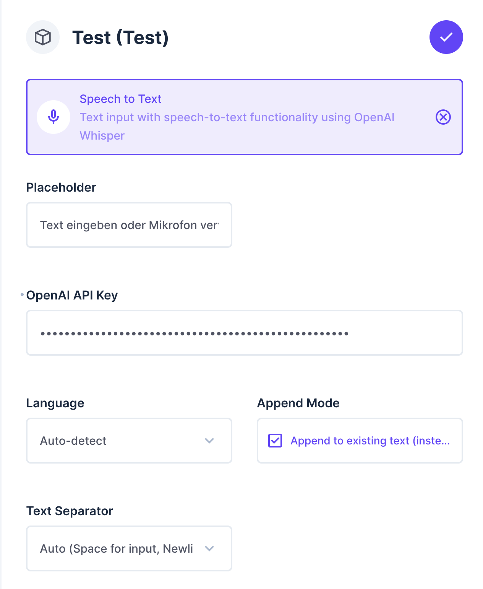
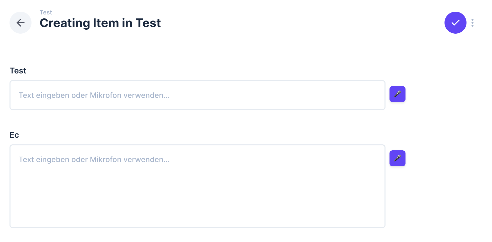

# Directus Speech-to-Text Interface

A Directus interface extension that enables voice input for text fields using OpenAI's Whisper API for speech recognition.

## Features

- 🎤 Voice input directly into Directus text fields
- 🌍 Multi-language support (German, English, Spanish, French, Italian, Portuguese, Russian, Japanese, Chinese)
- 🔄 Automatic language detection
- 🎯 Seamless integration with existing text fields
- ⚡ Real-time transcription with OpenAI Whisper
- 📝 Support for both single-line input and multi-line textarea fields
- ⚙️ Configurable append mode and text separators

## Screenshots

### Configuration Options

*Configure the Speech-to-Text interface with OpenAI API key, language selection, and text separator options.*

### Interface in Action

*The interface shows both single-line input and textarea fields with integrated microphone buttons for voice input.*

## Installation

### From npm (Recommended)

```bash
npm install directus-extension-speech-to-text
```

### Manual Installation

1. Clone and build the extension:
```bash
git clone https://github.com/flagbit/directus-extension-speech-to-text.git
cd directus-extension-speech-to-text
npm install
npm run build
```

2. Link extension to Directus:
```bash
npm run link
```

## Configuration

Configure the interface with the following options:

1. **OpenAI API Key** (Required): Your OpenAI API key for speech recognition
2. **Language**: Choose between auto-detection or specific languages
3. **Placeholder**: Customizable placeholder text
4. **Append Mode**: Toggle between replacing or appending to existing text
5. **Text Separator**: Configure how new text is separated (auto, space, newline, none)

## Usage

1. Add the Speech-to-Text interface to a String or Text field in your Directus collection
2. Enter your OpenAI API key in the interface options
3. Select your preferred language (optional - defaults to auto-detection)
4. Configure append mode and text separator as needed
5. Use the microphone button to start/stop voice recording

## Technical Details

- **Audio Format**: WebM with Opus codec, converted to WAV for optimal compatibility
- **Sample Rate**: 16kHz for optimal Whisper API performance
- **API**: OpenAI Whisper API v1
- **Framework**: Vue 3 + Directus Extensions SDK
- **File Size Limit**: 25MB per audio recording

## Development

```bash
# Development mode with file watching
npm run dev

# Build for production
npm run build

# Link to Directus for testing
npm run link
```

## Requirements

- Directus 10.10.0+
- Valid OpenAI API key
- HTTPS connection for microphone access (in production)
- Modern browser with MediaRecorder API support

## Browser Compatibility

- Chrome/Chromium 47+
- Firefox 29+
- Safari 14+
- Edge 79+

## License

MIT

## Author

Jörg Weller (joerg.weller@flagbit.de)